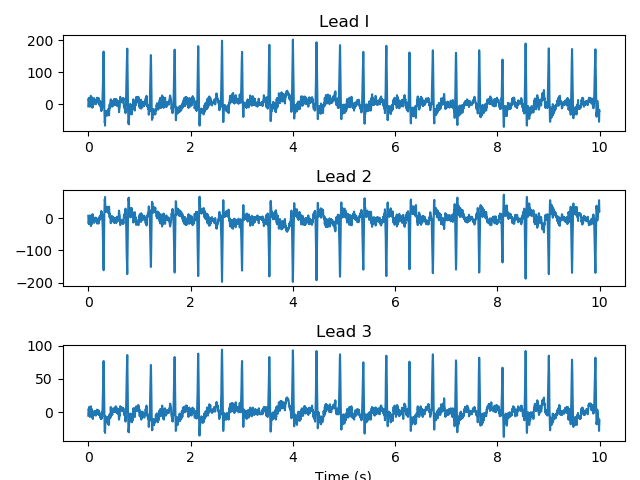

## ECG Interpretation

The `xml_to_ECG.py` file includes a class that reads in an XML file and creates an ECG signal object. Currently, the class has methods that can print random waveforms, including the `plot_random_arrhythmia()` method, which plots rhythms from the data that were labeled as arrhythmic.

---

#### To Run:
You must download your own XML file from the Biobank and add it to the `./data` folder. Next, in `xml_to_ECG.py`, change the following line, so it points to your data file:

```py
ECG_SIGNAL = ECGSignal('./data/ecg_biobank_test.xml')
```

The script will read the XML file, create a class, print all the tags in the XML file and plot a random arrhythmic trace. 

The baseline plot looks like:



#### To De-Identify Data
I made a file, **key.py**, that loads in XML files, removes identifying information, and writes the new files to a directory. The program creates a key so we can deidentify the files. 

If you want to deidentify data:
1. Move all of your XML files into a folder within the **data** directory.
2. Open **key.py**, scroll to the botthom and set the `path` variable equal to the path to your new folder.
3. Run **key.py**

**key.py** writes the XML files and key to a folder called `PATH_test`, where `PATH` is equal to the path you provided in step 2. You can see an example key, filled with fake identifying information of famous cooking reality TV stars, in the root directory.


